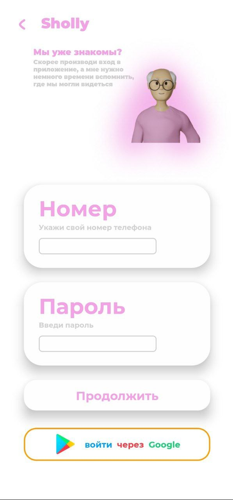
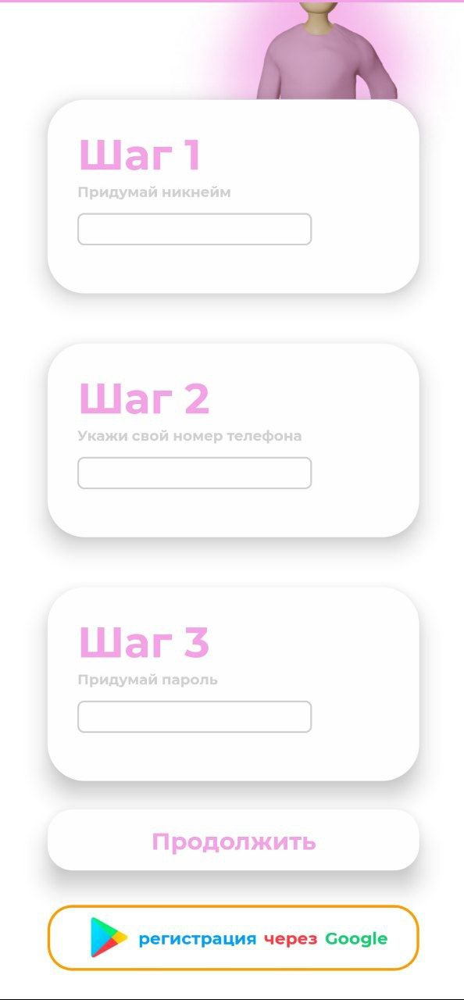

### Project descriprion

This was a team project. Schooly is chat/study app for school infastructure. The goal was to made place where students could communicate with their teachers, check their marks, homework and schedule.

In this project i implemented users database through google firebase.
Every one can login/sign up in app in different ways
        
         1. Through google

         2. Phone
         
         3. nickname, password

### App screenshots

| start window                         | login window                           | sign up window                       | avatar choose                  |
| ------------------------------ | ------------------------------ | ------------------------------ | ------------------------------ |
|             |     |                 |      
